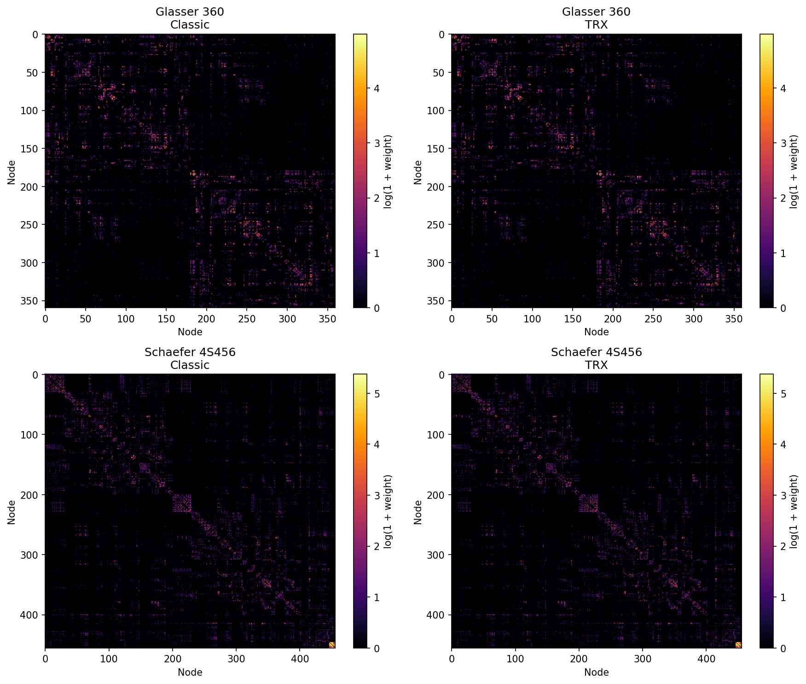

```{r}
#| label: r-setup
#| include: false

# Working directory for all bash chunks — created here, used throughout
wd <- file.path(dirname(normalizePath(knitr::current_input())), "walkthrough")
dir.create(wd, showWarnings = FALSE)
knitr::opts_knit$set(root.dir = wd)

# Prepend trx-mrtrix build binaries so bash chunks use them, not system MRtrix
Sys.setenv(PATH = paste0(
  "/Users/mcieslak/projects/trx-mrtrix/build/bin",
  ":", Sys.getenv("PATH")
))

# Number of streamlines — small for a fast demo render; scale up for production
Sys.setenv(N_TRACKS = "50000")
```

::: {.callout-note}
## Rendering notes

This document executes during render (`eval: true`).  All MRtrix binaries come
from the `trx-mrtrix` build at `build/bin/`, not the system installation.
The demo uses **50 000 streamlines** for a ~15-minute render; change `N_TRACKS`
in the R setup chunk for production use.
:::

## Timing and resource measurement

Every major command is wrapped with `mtime` — a thin shell function around
`/usr/bin/time -l` (macOS) that emits a one-line summary after each step:

```
┌─ tckgen (TRX)              ─────────────────────────────────────────────┐
│  wall:    52.3s    user:   812.4s    sys:    6.1s    peak mem: 2.31 GB  │
└─────────────────────────────────────────────────────────────────────────┘
```

| Metric | What it measures |
|--------|-----------------|
| **wall** | Elapsed clock time — the number you actually wait |
| **user** | Total CPU time across all threads; `user >> wall` for multithreaded commands |
| **sys** | Kernel time (I/O, memory mapping) |
| **peak mem** | Physical memory footprint (`phys_footprint` via `TASK_VM_INFO`) — excludes clean read-only mmap pages, so TRX files are not double-counted |

::: {.callout-note collapse="true"}
## Why not RSS?

`maximum resident set size` (RSS) counts clean file-backed mmap pages — TRX
files are opened read-only via mmap, so RSS is inflated for TRX inputs even
though those pages impose no memory pressure.  **`peak memory footprint`**
counts only dirty/anonymous pages and matches what Activity Monitor shows.
:::

---

## Setup

```{bash}
#| label: setup

DERIV=/Users/mcieslak/data/qsirecon/derivatives/qsirecon-MRtrix3_act-HSVS/sub-100307/dwi
PARC=/Users/mcieslak/data/qsirecon/sub-100307/dwi

source ../timing_utils.sh

ln -sf "$DERIV/sub-100307_space-T1w_model-msmtcsd_param-fod_label-WM_dwimap.mif.gz" wm_fod.mif.gz
ln -sf "$DERIV/sub-100307_space-T1w_model-mtnorm_param-inliermask_dwimap.nii.gz"     mask.nii.gz
ln -sf "$PARC/sub-100307_space-T1w_model-noddi_param-icvf_dwimap.nii.gz"             icvf.nii.gz
ln -sf "$PARC/sub-100307_space-T1w_model-noddi_param-isovf_dwimap.nii.gz"            isovf.nii.gz
ln -sf "$PARC/sub-100307_space-T1w_seg-Glasser_dseg.mif.gz"                          glasser.mif.gz
ln -sf "$PARC/sub-100307_space-T1w_seg-Glasser_dseg.txt"                             glasser.txt
ln -sf "$PARC/sub-100307_space-T1w_seg-4S456Parcels_dseg.mif.gz"                     4S456.mif.gz
ln -sf "$PARC/sub-100307_space-T1w_seg-4S456Parcels_dseg.txt"                        4S456.txt

echo "N_TRACKS = $N_TRACKS"
echo "tckgen:   $(which tckgen)"
echo "trxlabel: $(which trxlabel)"
ls -lh *.mif.gz *.nii.gz *.txt
```

---

## Step 1 — Generate streamlines

Both pipelines start from a common `tckgen` run.  MRtrix selects the writer
from the output filename extension, so the only difference is `.tck` vs `.trx`.

:::: {.columns}

::: {.column width="49%"}
<span class="badge-classic">CLASSIC</span>

```{bash}
#| label: tckgen-classic
source ../timing_utils.sh
mtime "tckgen (classic)" \
tckgen wm_fod.mif.gz       \
    -algorithm iFOD2        \
    -seed_image mask.nii.gz \
    -mask       mask.nii.gz \
    -minlength  30          \
    -maxlength  250         \
    -select     $N_TRACKS   \
    -nthreads   8           \
    -force                  \
    tracks.tck
```

```{bash}
tckinfo tracks.tck
du -sh  tracks.tck
```
:::

::: {.column width="49%"}
<span class="badge-trx">TRX</span>

```{bash}
#| label: tckgen-trx
source ../timing_utils.sh
mtime "tckgen (TRX float16)" \
tckgen wm_fod.mif.gz       \
    -algorithm iFOD2        \
    -seed_image mask.nii.gz \
    -mask       mask.nii.gz \
    -minlength  30          \
    -maxlength  250         \
    -select     $N_TRACKS   \
    -nthreads   8           \
    -trx_float16            \
    -force                  \
    tracks_f16.trx
```

```{bash}
tckinfo tracks_f16.trx
du -sh  tracks_f16.trx
```
:::

::::

The float16 TRX is roughly **half the size** of the TCK at the same streamline
count.  For the remainder of this walkthrough we use `tckconvert` to produce a
float32 TRX from the same TCK, so both pipelines operate on **byte-for-byte
identical streamlines** and any output differences are purely due to format, not
stochastic variation.

```{bash}
#| label: tckconvert-trx
source ../timing_utils.sh
mtime "tckconvert → TRX" \
tckconvert tracks.tck tracks.trx -force
```

```{bash}
tckinfo tracks.trx
du -sh  tracks.trx
```

---

## Step 2 — SIFT2 weighting

SIFT2 calibrates per-streamline weights to match the WM FOD amplitudes.  In the
classic pipeline the weights land in a separate CSV.  In the TRX pipeline they
are embedded as a `data_per_streamline` field named `weights`.

:::: {.columns}

::: {.column width="49%"}
<span class="badge-classic">CLASSIC</span>

```{bash}
#| label: sift2-classic
source ../timing_utils.sh
mtime "tcksift2 (classic)" \
tcksift2                   \
    tracks.tck             \
    wm_fod.mif.gz          \
    weights_classic.csv    \
    -nthreads 8            \
    -force
```

```{bash}
wc -l weights_classic.csv
du -sh tracks.tck weights_classic.csv
```
:::

::: {.column width="49%"}
<span class="badge-trx">TRX</span>

```{bash}
#| label: sift2-trx
source ../timing_utils.sh
mtime "tcksift2 (TRX)" \
tcksift2               \
    tracks.trx         \
    wm_fod.mif.gz      \
    weights            \
    -nthreads 8
```

```{bash}
tckinfo tracks.trx
```
:::

::::

---

## Step 3 — Sample NODDI scalar maps

NODDI provides two microstructure metrics:

- **ICVF** (intracellular volume fraction) — neurite density proxy
- **ISOVF** (isotropic volume fraction) — free water content

`tcksample` interpolates a volumetric image at every streamline vertex, yielding:

- **dpv** (per-vertex) — full sampled profile; used for mrview coloring and along-tract statistics
- **dps mean** (per-streamline) — one number per streamline; useful as a connectivity weight or covariate

:::: {.columns}

::: {.column width="49%"}
<span class="badge-classic">CLASSIC</span>

```{bash}
#| label: tcksample-classic
source ../timing_utils.sh
mtime "tcksample icvf dpv" \
tcksample tracks.tck icvf.nii.gz icvf.tsf -force

mtime "tcksample isovf dpv" \
tcksample tracks.tck isovf.nii.gz isovf.tsf -force

mtime "tcksample icvf mean" \
tcksample tracks.tck icvf.nii.gz icvf_mean.txt -stat_tck mean -force

mtime "tcksample isovf mean" \
tcksample tracks.tck isovf.nii.gz isovf_mean.txt -stat_tck mean -force

du -sh icvf.tsf isovf.tsf icvf_mean.txt isovf_mean.txt
```
:::

::: {.column width="49%"}
<span class="badge-trx">TRX</span>

```{bash}
#| label: tcksample-trx
source ../timing_utils.sh
mtime "tcksample icvf dpv" \
tcksample tracks.trx icvf.nii.gz icvf

mtime "tcksample isovf dpv" \
tcksample tracks.trx isovf.nii.gz isovf

mtime "tcksample icvf mean" \
tcksample tracks.trx icvf.nii.gz icvf_mean -stat_tck mean

mtime "tcksample isovf mean" \
tcksample tracks.trx isovf.nii.gz isovf_mean -stat_tck mean

tckinfo tracks.trx
```
:::

::::

::: {.callout-note}
## Viewing NODDI scalars in mrview

Open `tracks.trx` in `mrview → Tools → Tractography → Colour → Scalar file → TRX field…`
and select `icvf` or `isovf` for per-vertex coloring along each streamline.
No `.tsf` file needs to be loaded separately.
:::

---

## Step 4 — Atlas labeling and connectome construction

`tck2connectome` assigns streamlines to node pairs on-the-fly — the assignment
is ephemeral and must be recomputed for every new atlas or metric.

`trxlabel` embeds the assignment as TRX groups permanently.  Multiple atlases
can be labeled in a **single pass** over the tractogram by repeating `-nodes`,
`-lut`, and `-prefix` — geometry is read exactly once regardless of how many
atlases are requested.

### 4a — Classic: two separate tck2connectome runs

The classic pipeline must reread all geometry and redo the radial search for each atlas.

```{bash}
#| label: tck2connectome-glasser-classic
source ../timing_utils.sh
mtime "tck2connectome Glasser" \
tck2connectome                  \
    tracks.tck                  \
    glasser.mif.gz              \
    connectome_glasser_classic.csv \
    -tck_weights_in weights_classic.csv \
    -assignment_radial_search 2 \
    -symmetric                  \
    -zero_diagonal              \
    -force
```

```{bash}
#| label: tck2connectome-4S456-classic
source ../timing_utils.sh
mtime "tck2connectome 4S456" \
tck2connectome                  \
    tracks.tck                  \
    4S456.mif.gz                \
    connectome_4S456_classic.csv \
    -tck_weights_in weights_classic.csv \
    -assignment_radial_search 2 \
    -symmetric                  \
    -zero_diagonal              \
    -force
```

### 4b — TRX: both atlases in a single trxlabel pass

`trxlabel` accepts multiple `-nodes`/`-lut`/`-prefix` triplets and labels all
atlases in one pass over the tractogram — no geometry is read twice.

```{bash}
#| label: trxlabel-both
source ../timing_utils.sh
mtime "trxlabel Glasser + 4S456" \
trxlabel                         \
    tracks.trx tracks.trx        \
    -nodes  glasser.mif.gz       \
    -nodes  4S456.mif.gz         \
    -lut    glasser.txt          \
    -lut    4S456.txt            \
    -prefix glasser              \
    -prefix 4S456                \
    -assignment_radial_search 2  \
    -force
```

```{bash}
#| label: tckinfo-after-label
tckinfo tracks.trx
```

```{bash}
#| label: trx2connectome-glasser
source ../timing_utils.sh
mtime "trx2connectome Glasser" \
trx2connectome                   \
    tracks.trx                   \
    connectome_glasser_trx.csv   \
    -tck_weights_in weights      \
    -out_node_names glasser_nodes.txt \
    -group_prefix glasser        \
    -symmetric                   \
    -zero_diagonal               \
    -force
```

```{bash}
#| label: trx2connectome-4S456
source ../timing_utils.sh
mtime "trx2connectome 4S456" \
trx2connectome                 \
    tracks.trx                 \
    connectome_4S456_trx.csv   \
    -tck_weights_in weights    \
    -out_node_names 4S456_nodes.txt \
    -group_prefix 4S456        \
    -symmetric                 \
    -zero_diagonal             \
    -force
```

```{bash}
#| label: tckinfo-final
tckinfo tracks.trx
```

---

## Step 5 — Verify equivalence

`tck2connectome` orders its matrix by numeric node ID (1, 2, 3 …), while
`trx2connectome` orders alphabetically by group name.  Before comparing, we
reorder the TRX matrix into node-ID order using the same LUT.

```{bash}
#| label: diff-connectomes
python3 - <<'EOF'
import numpy as np

def load_lut(path):
    """Return {name: 0-based row index} ordered by node ID."""
    entries = []
    with open(path) as f:
        for line in f:
            parts = line.strip().split()
            if len(parts) >= 2:
                entries.append((int(parts[0]), parts[1]))
    entries.sort()
    return {name: i for i, (_, name) in enumerate(entries)}

def reorder_trx(trx_mat, trx_names, lut):
    """Permute TRX rows/cols from alphabetical to node-ID order."""
    # perm[i] = classic row for TRX row i
    perm = np.array([lut[n] for n in trx_names])
    inv  = np.empty(len(perm), dtype=int)
    inv[perm] = np.arange(len(perm))
    return trx_mat[np.ix_(inv, inv)]

atlases = [
    ("Glasser", "connectome_glasser_classic.csv", "connectome_glasser_trx.csv",
     "glasser_nodes.txt", "glasser.txt"),
    ("4S456",   "connectome_4S456_classic.csv",   "connectome_4S456_trx.csv",
     "4S456_nodes.txt",   "4S456.txt"),
]

for name, classic_f, trx_f, names_f, lut_f in atlases:
    classic    = np.loadtxt(classic_f, delimiter=",")
    trx        = np.loadtxt(trx_f,     delimiter=",")
    trx_names  = open(names_f).read().splitlines()
    lut        = load_lut(lut_f)
    trx_sorted = reorder_trx(trx, trx_names, lut)
    diff       = np.abs(classic - trx_sorted)
    print(f"\n── {name} {classic.shape} ──────────────────────")
    print(f"  Max |diff|:         {diff.max():.3e}")
    print(f"  Mean |diff|:        {diff.mean():.3e}")
    print(f"  Non-zero classic:   {(classic > 0).sum()}")
    print(f"  Non-zero TRX:       {(trx > 0).sum()}")
EOF
```

```{bash}
#| label: heatmaps
python3 - <<'EOF'
import numpy as np
import matplotlib
matplotlib.use("Agg")
import matplotlib.pyplot as plt

def load_lut(path):
    entries = []
    with open(path) as f:
        for line in f:
            parts = line.strip().split()
            if len(parts) >= 2:
                entries.append((int(parts[0]), parts[1]))
    entries.sort()
    return {name: i for i, (_, name) in enumerate(entries)}

def reorder_trx(trx_mat, trx_names, lut):
    perm = np.array([lut[n] for n in trx_names])
    inv  = np.empty(len(perm), dtype=int)
    inv[perm] = np.arange(len(perm))
    return trx_mat[np.ix_(inv, inv)]

pairs = [
    ("Glasser 360",    "connectome_glasser_classic.csv", "connectome_glasser_trx.csv",
     "glasser_nodes.txt", "glasser.txt"),
    ("Schaefer 4S456", "connectome_4S456_classic.csv",   "connectome_4S456_trx.csv",
     "4S456_nodes.txt",   "4S456.txt"),
]

fig, axes = plt.subplots(2, 2, figsize=(12, 10))
for row, (name, cf, tf, names_f, lut_f) in enumerate(pairs):
    classic    = np.loadtxt(cf, delimiter=",")
    trx        = np.loadtxt(tf, delimiter=",")
    trx_names  = open(names_f).read().splitlines()
    lut        = load_lut(lut_f)
    trx_sorted = reorder_trx(trx, trx_names, lut)
    for col, (mat, title) in enumerate([(classic, f"{name}\nClassic"), (trx_sorted, f"{name}\nTRX")]):
        ax = axes[row][col]
        im = ax.imshow(np.log1p(mat), cmap="inferno", aspect="auto")
        ax.set_title(title)
        ax.set_xlabel("Node")
        ax.set_ylabel("Node")
        plt.colorbar(im, ax=ax, label="log(1 + weight)")

plt.tight_layout()
plt.savefig("../connectome_comparison.png", dpi=150, bbox_inches="tight")
print("Saved connectome_comparison.png")
EOF
```



---

## Step 6 — File inventory

```{bash}
#| label: file-inventory
echo "=== Classic: files required to reproduce either connectome ==="
ls -lh tracks.tck weights_classic.csv icvf.tsf isovf.tsf icvf_mean.txt isovf_mean.txt \
        connectome_glasser_classic.csv connectome_4S456_classic.csv

echo ""
echo "=== TRX: everything in one file ==="
ls -lh tracks.trx connectome_glasser_trx.csv connectome_4S456_trx.csv
```

---

## What's next

::: {.callout-tip}
### Other commands that read/write TRX fields

| Command | TRX capability |
|---------|---------------|
| `tckedit` | Filters TRX by ROI, length, or count; remaps dps/dpv/groups to surviving streamlines |
| `tcksift` | Produces a TRX subset via `subset_streamlines` — all metadata preserved |
| `fixel2tsf` | Pass a bare field name as output to embed fixel scalars as dpv directly in TRX |
| `tsfinfo` / `tsfvalidate` | Inspect and validate TRX dpv fields |
| `mrview` | Loads TRX directly; colour by group, dps, or dpv field from the GUI |
:::
